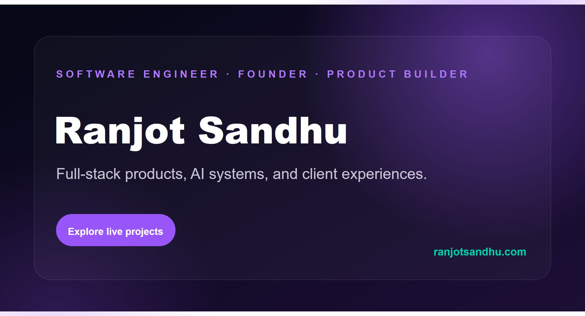

# Ranjot Sandhu - 3D Engineering Portfolio

An interactive portfolio built to connect software engineering claims to working products, technical case studies, and measurable outcomes.

[View the live portfolio](https://ranjot-sandhu.netlify.app)



## What this project demonstrates

- Interactive 3D scenes built with React Three Fiber and Three.js
- Recruiter-focused project case studies with live products, embedded demos, source links, architecture notes, and contribution details
- Responsive layouts, motion, typewriter effects, and a custom neural-network canvas background
- A validated contact workflow powered by EmailJS
- Performance-aware rendering for graphics-heavy pages

The portfolio covers full-stack products, machine learning experiments, networking coursework, client work, and independent projects. Project content is centralized in `src/constants/index.js`, which keeps the visual components reusable and the case studies easy to maintain.

## Performance decisions

3D experiences can become expensive quickly, so the site limits unnecessary work:

- The desktop scene is disabled on small screens and for visitors who prefer reduced motion.
- Earth and star canvases are lazy-loaded with `React.lazy` and `Suspense`.
- `IntersectionObserver` delays off-screen 3D content until it is near the viewport.
- Major React Three Fiber scenes use demand-based rendering where appropriate.
- Netlify headers apply long-lived caching to built assets and 3D model files.

## Tech stack

| Area | Technology |
| --- | --- |
| Interface | React 18, React Router, Tailwind CSS |
| 3D | Three.js, React Three Fiber, Drei, Maath |
| Motion | Framer Motion, React Vertical Timeline |
| Contact | EmailJS |
| Tooling | Vite, PostCSS, npm |
| Hosting | Netlify |

## Run locally

### Prerequisites

- Node.js 22 or newer
- npm

### Setup

```bash
git clone https://github.com/HydraIsProgramming/3D-Portfolio-Website.git
cd 3D-Portfolio-Website
npm ci
cp .env.example .env.local
npm run dev
```

Vite prints the local URL after startup. On Windows PowerShell, use `Copy-Item .env.example .env.local` instead of `cp`.

The contact form reads these variables:

```text
VITE_EMAILJS_SERVICE_ID
VITE_EMAILJS_TEMPLATE_ID
VITE_EMAILJS_PUBLIC_KEY
VITE_EMAILJS_TO_NAME
VITE_EMAILJS_TO_EMAIL
```

If EmailJS is not configured, the form displays a direct-email fallback instead of failing silently.

## Available scripts

```bash
npm run dev      # Start the Vite development server
npm run build    # Create an optimized production build in dist/
npm run preview  # Preview the production build locally
```

## Project structure

```text
src/
  components/          Page sections, project modal, and UI components
  components/canvas/   React Three Fiber scenes
  constants/           Experience, technology, and project case-study data
  assets/              Images, icons, and project artwork
public/
  demos/               Embedded browser demos for selected projects
  desktop_pc/          Hero GLTF model and textures
  planet/              Contact-section GLTF model and textures
  resume/              Downloadable resume
```

## Deployment

`netlify.toml` contains the production build command, SPA fallback, security headers, and asset caching rules. A deployment only needs the EmailJS environment variables listed above.

## License

This project is available under the [MIT License](LICENSE).
